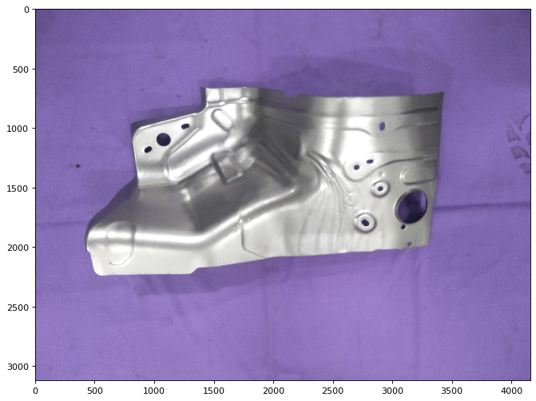

# aqvs
Automated Quality Verification System

- [Project Objective](#proj-obj)
- [Project Structure](#proj-struc)
- [Project Execution Summary](#proj-sum)
- [Project description](#proj-des)
- [Exploratory Data Analysis](#eda)
- [Object detection results](#results)
- [TO-DO](#to-do)


<a name="proj-obj"></a>
## 1. Project Objective
The objective of this project is to develop an API call to detect defects in automobile parts. The API is targeted to serve as an `Automatic Quality Verification System` on shop floors.

The developed model can detect and localise multiple defect types in the presented automobile part. If defects are found in the part, a bounding box is drawn around the defect area along with the defect label and model confidence.

This repository was created with the intention of making a common platform for object_detection that would allow plug and play for different architectures like Yolo, retinanet, Mask-RCNN etc. Such a platform would make future iterations with different object types faster, making it easier for others to implement their ideas.

To start building the common framework, Yolov2 and Retinanet were considered.

In the present state the yolov2 training codes are kept in `src2` folder and retinanet training codes are kept in `src` folder. Due to time constraints the two modules could not be combined for now and will be done in the near future.

<a name="proj-struc"></a>
## 2. Project Structure
The project data and codes are arranged in the following manner:

```
aqvs
  ├── train.py
  ├── config.py
  ├── app/app.py     #code for mobile deployment
  ├── src    #presently holding scripts for retinanet
  |   ├── evaluation/
  |   ├── training/
  |   ├── prediction/
  |   ├── networks/   
  |   └── utils/
  ├── src    #presently holding scripts for yolov2
  |   ├── evaluation/
  |   ├── training/
  |   ├── prediction/
  |   ├── networks/   
  |   └── utils/
  ├── data
  |   ├── retinanet {all images and corresponding xml files together}
  |   ├── YE358311  {original data received}
  |   ├── pretrained {all pretrained model weights for transfer learning}  
  |  
```

_Data_: <br>
the `data` folder is not a part of this git project as it is confidential. Please send a message if you need the same.


<a name="proj-sum"></a>
## 3. Project Execution Summary
Steps in brief that were taken to carry out this project:

 **Step 1:**  Manual examination of the data shared. In the Manual examination we found that few images were misclassified, like IMG20180905145901.jpg is in defects category but I could not find any defect on the product.

<div style="text-align: center"></div>

 Similarly IMG20180905151135.jpg has signs of wrinkle in it, but was tagged as healthy.

<div style="text-align: center"></div>

 Such mixed instances made the manual annotation of the data time consuming.

 **Step 2:** EDA on the data to further understand the data. Here I was trying to check if traditional image processing can yield results in this case. The results have been shown in a Jupyter-Notebook [here](./notebooks/EDA.ipynb)

 **Step 3:**  Annotating the defective parts for localising crack and wrinkle as the two defect types. This is done using the tool labelImg. The software is open-source and can be found [here](https://github.com/tzutalin/labelImg)

 **Step 4:**  Converting the xmls obtained from labelImg into csvs as required by the object detection training code. This is done using the script [here](./src/utils/xml_to_csvs.py)

 **Step 5:**  Training the annotated data on yolov2. This is demonstrated in a Jupyter-Notebook [here](./notebooks/training_yolov2.ipynb)

 **Step 6:**  Checking inference statistics on the yolov2 tranined model. This is demonstrated in the notebook [here](./notebooks/inference_yolov2.ipynb)

 **Step 7:**  Training the annotated data on retinanet. This is demonstrated in the notebook [here](./notebooks/training_retinanet.ipynb)

 **Step 8:**  Checking inference statistics on the retinanet tranined model. This is demonstrated in the notebook [here](./notebooks/inference_retinanet.ipynb)

 **Step 9:**  Writing the mobile deployment code. This is done via the script [here](./app/app.py)


<a name="proj-des"></a>
## 4. Project description
The training script is `train.py` <br>

The entire training configuration including the dataset path, hyper-parameters and other arguments are specified in `config.py`, which you can modify and experiment with. It gives a one-shot view of the entire training process. <br>

Support for `parallel processing` at CPU level for datapreparation and subsequent `multi-gpu` training has been added.

Explore `config.py` to learn more about the parameters you can tweak.


For training, make the desired configuration in `config.py` and then run `train.py` as:

```
python train.py
```

<a name="eda"></a>
## 5. Exploratory Data Analysis
Before jumping into deep learning, it is important to examine traditional image processing techniques on the data to yield useful insights.

I tried preliminary segmenting the desired part from the background, using thresholding techniques.

Defective Part:
<div style="text-align: left"></div>
<br>

Otsu Thresholded:
<div style="text-align: left"></div>
<br>

HSV Split:
<div style="text-align: left"></div>
<br>

Saturation channel thresholding:
<div style="text-align: left"></div>
<br>

Although Saturation channel thresholding seemed to perform well on almost 95% of the data, it was failing in edge cases. Due to time constraints I did not work on this further, and so the idea of employing traditional image processing was dropped.

<a name="results"></a>
## 6. Object detection results
The Yolov2 model gave several false detections and so it was not considered for the time being. The code may be faulty and I will have to do a through analysis of the code again. May be somewhere I made a typing error and thats causing blunder.

On the contrary, the retinanet model gave results with 13 epochs and 100 steps per epoch for training.

<div style="text-align: left"></div>
<br>

<div style="text-align: left"></div>
<br>

<div style="text-align: left"></div>
<br>

There were few erorr cases observed as below:
<div style="text-align: left"></div>
However, the error cases had low confidence.

<a name="to-do"></a>
## 7. To-Do
- [x] Data download and Analysis
- [x] Data scripts preparation
- [x] Data loader
- [x] Data Generator
- [ ] Data Augmentor
- [ ] Add multi-gpu support for training
- [x] Generate priliminary results
- [ ] Add multiple network support
- [ ] Training and Parameter Tuning
